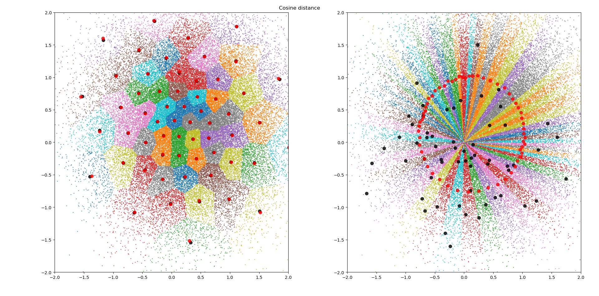

# clustering-pytorch
The pytorch implementation of clustering algorithms (k-mean, mean-shift). These algorithms support running on several GPUs.

## K-Means
Speed test on GTX 1060 (6G) and Inter(R) Core(TM)i5-7400 CPU @ 3.00 GHz.  

data format (samples, dimension, cluster_centers), 10 iteration are used in the following test.

| Device | save_memory | （10000, 2, 100) | (10000, 2, 1000) | (100000, 2, 100) | (100000, 2, 1000) | (20000, 200, 400) |
| ------ | ----------- | ---------------- | ---------------- | ---------------- | ----------------- | ----------------- |
| CPU    | True        | 3.2s             | 9.9s             | 59.0s            | 80.9s             | 29.2s             |
| GPU    | True        | 26.3s            | 18.2s            | 159.3s           | 168.7s            | 31.5s             |
| CPU    | False       | 0.2s             | 2.0s             | 1.6s             | 14.6s             | 25.0s             |
| GPU    | False       | 0.3s             | 1.9s             | 0.3s             | 2.1s              | OOM               |

The simple usages of K-means algorithms.
```python
    import matplotlib.pyplot as plt
    torch.manual_seed(0)
    N, D, K = 64000, 2, 60
    x = 0.7 * torch.randn(N, D) + 0.3
    x = 0.7 * torch.randn(N, D) + 0.3
    # if the data dimension and the clustering centers are large, I recommend to set save_memory=True. Otherwise, always set to False.
    kmeans_euc = KMeansLayer(K, 10, distance='euclidean', save_memory=False)  # set to cuda if necessary,
    kmeans_cos = KMeansLayer(K, 10, distance='cosine', save_memory=False)
    avg_c, cl, c, index = kmeans_euc(x)
    avg_c_, cl_, c_, index_ = kmeans_cos(x)
    plt.subplot(121)
    plt.suptitle('Euclidean distance')
    plt.scatter(x[:, 0].cpu(), x[:, 1].cpu(), c=cl.cpu(), s=30000 / len(x), cmap="tab10")
    plt.scatter(c[:, 0].cpu(), c[:, 1].cpu(), c="black", s=50, alpha=0.8)
    plt.scatter(avg_c[:, 0].cpu(), avg_c[:, 1].cpu(), c="red", s=50, alpha=0.8)
    plt.axis([-2, 2, -2, 2])

    plt.subplot(122)
    plt.suptitle('Cosine distance')
    avg_c, cl, c, index = avg_c_, cl_, c_, index_
    plt.scatter(x[:, 0].cpu(), x[:, 1].cpu(), c=cl.cpu(), s=30000 / len(x), cmap="tab10")
    plt.scatter(c[:, 0].cpu(), c[:, 1].cpu(), c="black", s=50, alpha=0.8)
    plt.scatter(avg_c[:, 0].cpu(), avg_c[:, 1].cpu(), c="red", s=50, alpha=0.8)
    plt.axis([-2, 2, -2, 2])

    plt.tight_layout()
    plt.show()
```

Some testing images ...  


